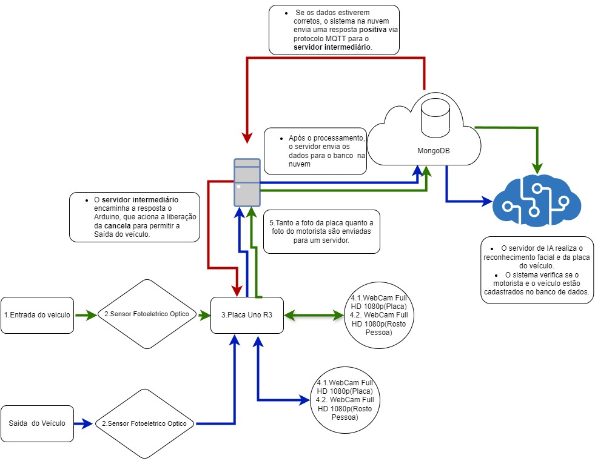

# Estacione Seguro

## Visão Geral do Projeto

O **Estacione Seguro** é um sistema de segurança inteligente para estacionamentos, desenvolvido para utilizar tecnologias de Internet das Coisas (IoT) e Inteligência Artificial (IA). Seu objetivo é monitorar e identificar veículos e motoristas, aumentando a segurança e prevenindo furtos. O sistema realiza reconhecimento facial e de placas de veículos, além de comparar imagens de entrada e saída para verificar se o motorista e o carro são os mesmos.

## Funcionalidades

### Requisitos Funcionais (RF)
1. **RF01**: Identificar quando um veículo entra ou sai do estacionamento.
2. **RF02**: Capturar uma foto do motorista e da placa do veículo após a identificação.
3. **RF03**: Armazenar as informações capturadas no banco de dados.
4. **RF04**: Cadastrar o motorista e a placa do veículo no banco de dados.
5. **RF05**: Comparar os dados iniciais de entrada do motorista com os dados de saída.
6. **RF06**: Verificar se o motorista e o veículo são os mesmos na saída.
7. **RF07**: Em caso de roubo, enviar uma notificação ao proprietário do veículo.
8. **RF08**: O sistema deve acionar automaticamente a câmera e o sensor ao detectar a entrada ou saída do veículo.
9. **RF09**: O sistema deve verificar se o veículo possui uma assinatura válida ou ticket de estacionamento no momento da entrada.
10. **RF10**: Caso o veículo não esteja cadastrado, o sistema deve solicitar o cadastro e a inserção de detalhes do usuário.
11. **RF11**: O sistema deve enviar notificações em tempo real para a equipe de estacionamento quando forem detectadas anomalias.
12. **RF12**: Uma interface web ou móvel deve estar disponível para que os usuários possam verificar seu histórico de estacionamento e cadastrar veículos remotamente.
13. **RF13**: O sistema deve registrar a hora de entrada e saída de cada veículo para auditoria e relatórios.
14. **RF14**: O sistema deve gerar relatórios diários, semanais ou mensais sobre o uso do estacionamento.

### Requisitos Não Funcionais (RNF)
1. **RNF01**: A câmera deve ter alta resolução para capturar detalhes como rostos e placas de veículos.
2. **RNF02**: A IA deve ser rápida e precisa na identificação e análise de dados, minimizando falsos positivos e negativos.
3. **RNF03**: O servidor deve garantir a segurança dos dados, implementando criptografia e proteção contra invasões.
4. **RNF04**: O sistema deve operar 24/7 com alta disponibilidade, exceto durante manutenção ou problemas imprevistos.
5. **RNF05**: O tempo de resposta do sistema para detectar a entrada do veículo e comparar os dados do motorista deve ser inferior a 2 segundos.
6. **RNF06**: As câmeras devem operar em condições de baixa luminosidade, garantindo o funcionamento durante a noite.
7. **RNF07**: O modelo de rede neural deve ser capaz de processar e reconhecer imagens com uma precisão mínima de 95% para o reconhecimento de rosto e placa.
8. **RNF08**: O sistema deve ser escalável para suportar múltiplos pontos de entrada/saída sem degradação de desempenho.
9. **RNF09**: O sistema deve estar em conformidade com as regulamentações de privacidade de dados, garantindo o tratamento adequado de informações pessoais e sensíveis.

## Arquitetura do Sistema

### Componentes de Hardware
1. **Câmeras de Segurança**:
   - Capturam imagens de alta resolução dos veículos e motoristas.
   - Monitoram continuamente o estacionamento, 24 horas por dia.
   
2. **Servidor de IA**:
   - Processa as imagens para realizar o reconhecimento facial e de placas dos veículos.
   - Realiza comparações entre as imagens de entrada e saída.

3. **Banco de Dados**:
   - Armazena as informações dos motoristas, veículos e eventos de alerta.
   - Implementa medidas de segurança, como criptografia, para garantir a integridade dos dados.

### Fluxo de Funcionamento
1. **Entrada**:
   - A câmera captura a imagem do motorista e a placa do veículo.
   - O sistema processa as imagens e verifica se o motorista e o veículo estão cadastrados.

2. **Análise**:
   - A IA processa as imagens e realiza o reconhecimento facial e de placa.
   - Caso o motorista ou veículo não estejam cadastrados, o sistema os registra.

3. **Saída**:
   - A câmera captura novamente a imagem do motorista e do veículo.
   - A IA compara as imagens de entrada e saída. Se houver discrepância, o sistema gera um alerta.

## Tecnologias Utilizadas

- **Internet das Coisas (IoT)**: Câmeras conectadas para monitoramento contínuo, sensores.
- **Inteligência Artificial (IA)**: Algoritmos de reconhecimento facial e de placas para análise de imagens.
- **Banco de Dados**: Será utilizado o Banco MongoDB para armazenamento seguro dos dados de motoristas, veículos e acessos.
- **Segurança**: Implementação de criptografia e controle de acesso para proteger dados sensíveis.
- **Linguagem**: Será utilizado o C/C++ para comunicação com o Arduino e Python para as demais funcionalidades.
